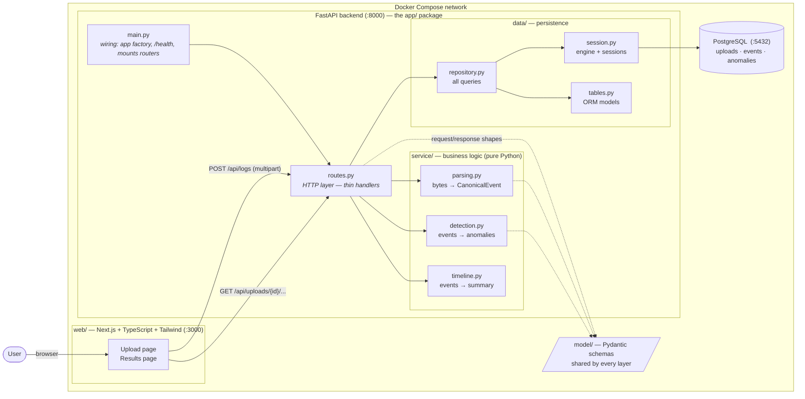
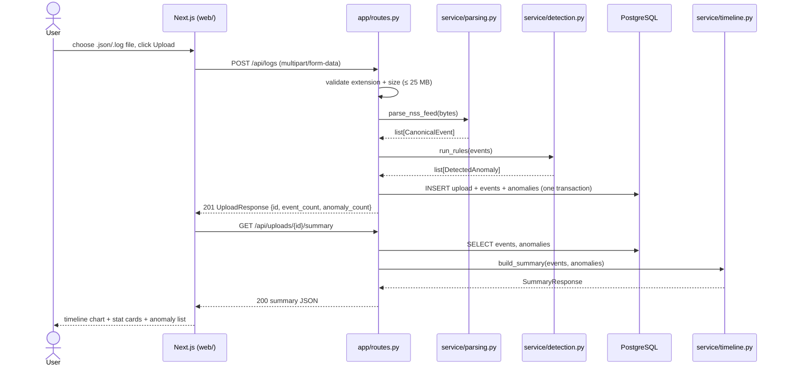
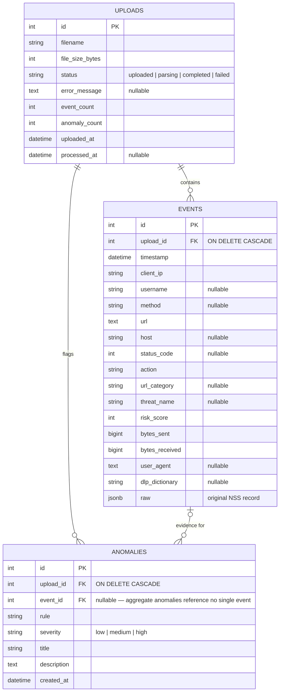

# Security Anomaly API — Spec

A small, polished prototype: upload a NSS web-log file through a web
UI, parse and normalize it, flag suspicious activity with transparent
rule-based detection, and present the result as a human-readable timeline of
events.

This document is the **source of truth** for the system design and the
**build guide** for the backend. Every backend module stub points back here.

---

## 1. Goals & Non-Goals

**Goals (v1)**
- Upload one log file via the browser; get back a clear timeline + anomaly summary.
- Support exactly one input format: **Zscaler "NSS Feed Output Format: Web Logs"**, JSON output type.
- Rule-based heuristic detection (deterministic, explainable, testable).
- One-command local deployment via Docker Compose.
- Responsive, polished UI.

**Non-goals (explicitly out of scope)**
- Authentication / multi-user support. Single-user local prototype.
- Other log formats (firewall/DNS NSS feeds, syslog, etc.).
- ML-based detection, real-time streaming, background job queues.
- Retention policies, multi-tenancy, RBAC, audit trails.

---

## 2. Architecture Overview

Three deployable units, wired together by Docker Compose:



**Layer rules** (what makes this architecture stay clean as it grows):

| Layer | File(s) | May import | Must NOT import |
|---|---|---|---|
| Entry point | `app/main.py` | `routes` | service, data internals |
| HTTP | `app/routes.py` | `service`, `data.repository`, `model` | sqlalchemy directly, parsing internals |
| Logic | `app/service/*` | `model` | FastAPI, sqlalchemy (pure = testable) |
| Persistence | `app/data/*` | sqlalchemy, `model` | FastAPI |
| Schemas | `app/model/*` | pydantic | anything else |

The frontend never talks to Postgres; the backend never renders HTML. All
frontend↔backend traffic is the REST contract in §5.

---

## 3. Log Format & Canonical Schema

### 3.1 Input: Zscaler NSS Web Logs (JSON)

The [Zscaler Nanolog Streaming Service (NSS)](https://help.zscaler.com/zia/nss-feed-output-format-web-logs)
streams web-proxy logs to a SIEM. Its "Web Logs" feed with the **JSON output
type** produces one JSON object per web transaction, with keys like
`time`, `login`, `cip`, `eurl`, `action`, `threatname`, `riskscore`, …

A file may be either:

- a **JSON array**: `[{...}, {...}, {...}]` (NSS "JSON Array Notation"), or
- **NDJSON**: one JSON object per line.

The parser must accept both. Sample file: `tests/fixtures/sample_nss_web.json`.

### 3.2 Field mapping: NSS → canonical

Everything the rest of the system needs, and nothing it doesn't:

| NSS JSON field | Canonical field | Type | Notes |
|---|---|---|---|
| `time` | `timestamp` | `datetime` | e.g. `"Thu Sep 10 2026 09:15:23"` → parse to **timezone-aware UTC** |
| `cip` | `client_ip` | `str` | client (source) IP |
| `login` | `username` | `str \| None` | `"None"` = unauthenticated → `None` |
| `reqmethod` | `method` | `str \| None` | GET/POST/… |
| `eurl` | `url` | `str` | hex-escaped; decode `%20` → space etc. |
| `ehost` | `host` | `str \| None` | destination hostname |
| `respcode` | `status_code` | `int \| None` | `"200"` → `200` |
| `action` | `action` | `str` | `"Allow"` / `"Block"` |
| `urlcat` | `url_category` | `str \| None` | e.g. `"Gambling"` |
| `threatname` | `threat_name` | `str \| None` | `"None"` = clean → `None` |
| `riskscore` | `risk_score` | `int` | 0–100 |
| `reqsize` | `bytes_sent` | `int` | client → server (upload direction) |
| `respsize` | `bytes_received` | `int` | server → client |
| `ua` | `user_agent` | `str \| None` | |
| `dlpdict` | `dlp_dictionary` | `str \| None` | DLP dictionary that matched, if any |

Every other NSS field (`sip`, `dept`, `location`, `appname`, `ereferer`, …)
is preserved in the `events.raw` JSONB column, so nothing is lost — promote a
field into the canonical schema only when a rule or the UI actually needs it.

### 3.3 Parsing gotchas (learned from the NSS docs)

1. **Hex-escaping**: URLs/hosts/referrers hex-encode non-printable and
   non-ASCII chars (`%20`, `%0A`, …). Decode them or the UI shows garbage.
2. **Sentinel values**: NSS writes the literal string `"None"` for empty
   fields. Normalize to `None`, or `"None"` will pollute stats and user lists.
3. **Numbers arrive as strings**: `"riskscore": "92"` → coerce to `int`.
4. **Timestamps are local-time strings without a zone**: pick a convention
   (assume UTC is fine for the prototype), parse with
   `datetime.strptime(t, "%a %b %d %Y %H:%M:%S")`, and attach `UTC`.
5. **Partial garbage is normal**: skip malformed records (count them), fail
   the upload only when *nothing* parses.

---

## 4. Request Lifecycle



Processing is **synchronous** inside `POST /api/logs`: files are small
(≤ 25 MB), so parsing + detection finish well under a second and the response
already contains the final counts. No worker, no polling.

---

## 5. API Contract

Base URL: `http://localhost:8000`. All bodies JSON unless noted.
The frontend (`web/lib/api.ts`) implements against exactly this contract.

### `POST /api/logs`

Upload a log file. `multipart/form-data`, field name **`file`**.

- **201** → `UploadResponse`
  ```json
  {
    "id": 42,
    "filename": "nss_web.json",
    "status": "completed",
    "event_count": 6,
    "anomaly_count": 7
  }
  ```
- **400** — empty file, or unsupported extension (accept `.json`, `.log`, `.txt`).
- **413** — file over the 25 MB cap.
- **422** — content isn't recognizable as NSS web-log JSON.

### `GET /api/uploads/{id}` → `UploadStatus`

```json
{
  "id": 42,
  "filename": "nss_web.json",
  "status": "completed",
  "uploaded_at": "2026-09-16T14:02:11Z",
  "processed_at": "2026-09-16T14:02:11Z",
  "event_count": 6,
  "anomaly_count": 7,
  "error_message": null
}
```
**404** for unknown ids.

### `GET /api/uploads/{id}/events` → `EventPage`

Query params: `limit` (default 50, max 200), `offset` (default 0),
optional filters `action`, `url_category`, `anomalies_only=true`.

```json
{
  "items": [
    {
      "id": 3,
      "timestamp": "2026-09-10T10:03:41Z",
      "client_ip": "10.1.4.22",
      "username": "carol.davis",
      "method": "GET",
      "url": "http://cdn-update.example-bad.net/payload.exe",
      "host": "cdn-update.example-bad.net",
      "status_code": 200,
      "action": "Block",
      "url_category": "Miscellaneous",
      "threat_name": "Trojan.Win32.FakeAV",
      "risk_score": 92,
      "bytes_sent": 640,
      "bytes_received": 2048000,
      "user_agent": "Mozilla/5.0 (Windows NT 10.0; Win64; x64)"
    }
  ],
  "total": 6,
  "limit": 50,
  "offset": 0
}
```

### `GET /api/uploads/{id}/summary` → `SummaryResponse`

The entire results page in one call:

```json
{
  "upload_id": 42,
  "time_range_start": "2026-09-10T03:12:47Z",
  "time_range_end": "2026-09-10T13:05:55Z",
  "total_events": 6,
  "unique_clients": 6,
  "unique_users": 5,
  "blocked_count": 2,
  "allowed_count": 4,
  "top_categories": [{"category": "Miscellaneous", "count": 2}],
  "top_hosts": [{"host": "www.google.com", "count": 1}],
  "timeline": [
    {"bucket_start": "2026-09-10T03:00:00Z", "event_count": 1, "blocked_count": 0, "anomaly_count": 1},
    {"bucket_start": "2026-09-10T09:00:00Z", "event_count": 2, "blocked_count": 1, "anomaly_count": 1}
  ],
  "anomalies": [
    {
      "id": 7,
      "rule": "threat-detected",
      "severity": "high",
      "title": "Malware blocked: Trojan.Win32.FakeAV",
      "description": "carol.davis (10.1.4.22) downloaded payload.exe — detected as Trojan.Win32.FakeAV (risk 92).",
      "event_id": 3,
      "timestamp": "2026-09-10T10:03:41Z"
    }
  ]
}
```

**Timeline bucketing**: divide the observed range into ≤ 60 buckets using a
"nice" width (1m / 5m / 15m / 1h / 6h / 1d). One bucket is fine when all
events share a timestamp; empty list stays valid (zeroed summary).

### `GET /health`

`{"status": "healthy", "time": "<iso8601>"}` — already implemented in
`app/main.py`; used by Docker healthchecks.

---

## 6. Data Model



Notes:

- **Indexes**: `events(upload_id, timestamp)` (timeline + paging),
  `anomalies(upload_id)` (summary).
- **`raw` JSONB** preserves the untouched NSS record — debugging and future
  fields without migrations.
- **Upload status state machine**: `uploaded → parsing → completed`, or
  `parsing → failed` with `error_message` set. Persist the row *first*, so a
  failed parse still leaves an auditable upload record.
- Add the DB dependencies yourself: `uv add sqlalchemy "psycopg[binary]"`.
  Schema creation via `Base.metadata.create_all` on startup is fine for a
  prototype (no Alembic needed).

---

## 7. Detection Rules

Rule-based heuristics — deterministic, unit-testable, explainable in one
sentence each. Implement each as a small function in
`app/service/detection.py` and wire it into `run_rules`.

**Stateless rules** (one event at a time):

| Rule | Severity | Fires when | Title example |
|---|---|---|---|
| `threat-detected` | high | `threat_name` is set | "Malware blocked: Trojan.Win32.FakeAV" |
| `high-risk-score` | medium | `risk_score ≥ 75` | "High-risk destination (score 92)" |
| `suspicious-url-category` | medium | `url_category` ∈ {Gambling, Anonymizers, Phishing, Adult Content, Hacking, Piracy} | "Visit to Gambling site" |
| `dlp-violation` | high | `dlp_dictionary` is set | "DLP match: Credit Cards" |
| `large-upload` | high | `bytes_sent ≥ 10 MB` | "25 MB uploaded to filedrop.example-share.com" |
| `off-hours` | low | timestamp outside 07:00–19:00 | "Activity at 03:12" |

**Aggregate rules** (look at the whole event list):

| Rule | Severity | Fires when | Title example |
|---|---|---|---|
| `repeated-blocks` | medium | one `client_ip` blocked ≥ 10 times | "10.1.3.44 blocked 14 times" |
| `request-burst` | medium | one `client_ip` makes > 100 requests in any 60 s window | "10.1.2.15: 230 requests in 60s" |

Guidance:

- Thresholds are module-level constants so tests can tweak them.
- Aggregate anomalies have `event_index = None`; per-event anomalies set it
  so the UI can deep-link to the offending event.
- Every anomaly gets a `title` (one line, for badges/lists) and a
  `description` (1–2 sentences with the who/what/when — this is what makes
  the output *human-readable*).
- Later candidates (not in v1): beaconing (regular-interval requests),
  geographic anomalies.

---

## 8. Frontend (`web/`)

Next.js (App Router) + TypeScript + Tailwind CSS. Fully implemented against
this spec; talks to the backend only through the typed client in
`web/lib/api.ts`.

- **`/` — upload page**: drag & drop zone + file picker, client-side
  validation (extension, ≤ 25 MB), progress states
  (`idle → uploading → processing → done | error`), then routes to results.
- **`/uploads/[id]` — results page**: summary stat cards (totals,
  blocked/allowed, unique clients/users), bucketed timeline bar chart,
  anomaly list with severity badges, and a filterable events table.
- **Mock mode**: `NEXT_PUBLIC_MOCK_API=1` serves fixture data so the UI runs
  before the backend exists (see `web/lib/mock.ts`).
- **Config**: backend URL via `NEXT_PUBLIC_API_URL` (default
  `http://localhost:8000`).

Run it: `cd web && npm install && npm run dev` → http://localhost:3000.

---

## 9. Docker & Deployment

Docker files are **user-written** (learning exercise); this section is the
acceptance checklist. Review happens together after.

**`Dockerfile`** (repo root — backend):
- [ ] `FROM python:3.11-slim`
- [ ] installs deps from `pyproject.toml` + `uv.lock` (uv or pip)
- [ ] copies `app/`
- [ ] `CMD ["uvicorn", "app.main:app", "--host", "0.0.0.0", "--port", "8000"]`

**`web/Dockerfile`**:
- [ ] `FROM node:22-alpine`, `npm ci` from lockfile, `npm run build`
- [ ] serves on port 3000 (`npm start`)

**`docker-compose.yml`** (repo root):
- [ ] `db`: `postgres:16-alpine`, named volume for data, `pg_isready`
      healthcheck, `POSTGRES_*` env vars
- [ ] `api`: builds from root, `DATABASE_URL=postgresql+psycopg://…@db:5432/…`,
      `depends_on: db (condition: service_healthy)`, publishes `8000`
- [ ] `web`: builds `./web`, `NEXT_PUBLIC_API_URL=http://localhost:8000`,
      publishes `3000`
- [ ] one command — `docker compose up --build` — yields a working system:
      UI at :3000, `/health` at :8000 returns 200, upload round-trip succeeds

---

## 10. Build Order (backend learning path)

Build bottom-up; each step has a "done when" checkpoint. Remove the
`pytest.mark.skip` markers as you go — the skipped tests are your checklist.

| # | Step | File(s) | Done when |
|---|---|---|---|
| 1 | DB session + deps | `app/data/session.py` | `uv add sqlalchemy "psycopg[binary]"`; engine connects to Postgres |
| 2 | Pydantic schemas | `app/model/` | you can instantiate `CanonicalEvent` from one fixture record in a REPL |
| 3 | ORM tables | `app/data/tables.py` | `create_all` runs; `\dt` in psql shows 3 tables |
| 4 | Parser | `app/service/parsing.py` | `uv run pytest tests/test_parsing.py` passes |
| 5 | Detection rules | `app/service/detection.py` | `tests/test_detection.py` passes (incl. negative tests) |
| 6 | Timeline/summary | `app/service/timeline.py` | fixture events → sensible buckets + stats |
| 7 | Repository | `app/data/repository.py` | round-trip: insert fixture events, read them back |
| 8 | Routes | `app/routes.py` | `curl -F file=@tests/fixtures/sample_nss_web.json localhost:8000/api/logs` → 201; `GET …/summary` returns JSON; `tests/test_api.py` passes |
| 9 | Docker files | root + `web/` | `docker compose up --build` works end-to-end |
| 10 | End-to-end | — | upload via the UI at :3000 → timeline renders |

Stuck? The skipped example tests show the expected call patterns, and every
stub docstring links back to the relevant section of this spec.

---

## 11. Testing Strategy

- **Pure logic first** (`service/`): no DB or HTTP needed. Positive *and*
  negative tests per rule; boundary tests just under/over each threshold;
  the fixture file is designed to trigger several rules at once.
- **Repository**: round-trip tests against a throwaway database (separate
  `DATABASE_URL`).
- **API**: `fastapi.testclient.TestClient` + dependency override of
  `get_session` (pattern shown in `tests/test_health.py`).
- **Frontend**: `npm run build` (typecheck + production build) before
  handoff; manual smoke of upload → results in mock mode.
- Commands: `uv run pytest` (root), `uv run ruff check .`, `npm run build`
  (in `web/`).

---

## 12. Security & Operational Notes

- **Upload validation**: extension allowlist + 25 MB cap; the filename is
  metadata only (never used as a path); content is parsed as data, never
  executed or rendered raw.
- **SQL injection**: all DB access through the SQLAlchemy ORM
  (`app/data/repository.py` is the only query site). No string-built SQL.
- **CORS**: allow only `http://localhost:3000` (and `:8000` for curl work).
- **Secrets**: DB credentials come from env vars; compose defaults are
  local-only dev values — no real secrets in the repo.
- **Data sensitivity**: web logs contain usernames, IPs, and browsing
  history. This prototype stores them locally only; don't point it at real
  production logs without a conversation about PII.
- **Error handling**: parse failures return 422 with a useful message and
  mark the upload `failed`; unexpected exceptions → 500, logged server-side,
  never leaking internals to the client.
